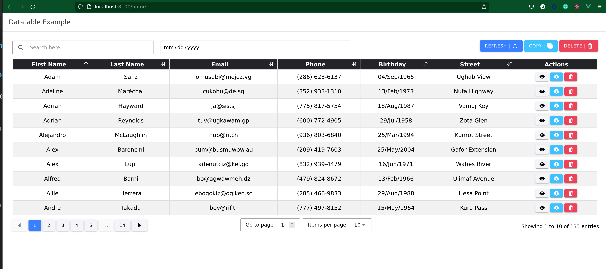

# vTable

An advanced Data table for Ionic Vue framework.

<p>
  <a href="https://sonarcloud.io/summary/new_code?id=uniquedj95_vtable"></a>
  <a href="https://ionicframework.com/"></a>
  <a href="https://vuejs.org/"></a>
  <a href="https://www.typescriptlang.org/"></a>
  <a href="https://lodash.com/"></a>
  <a href="https://www.npmjs.com/package/@uniquedj95/vtable"></a>
</p>




## Installation

```bash
npm install @uniquedj95/vtable

OR

yarn add @uniquedj95/vtable
```

## Usage

Register datatable globally

```typescript
// src/main.ts
import { VTable } from "@uniquedj95/vtable"

// import datatable css
import '@uniquedj95/vtable/dist/lib/datatable.css'

const app = createApp(App)
  .use(IonicVue)
  .use(VTable)
  .use(router)

router.isReady().then(() => {
  app.mount('#app');
});
```

```HTML
// Example.vue
<template>
  <data-table :rows="rows" :columns="columns"></data-table>
</template>
```

Register datatable locally

```html
<script lang="ts">
  import { DataTable } from "@uniquedj95/vtable"
  import { defineComponent } from "vue"

  export default defineComponent({
    data: () => ({
      rows: [],
      columns: []
    })
    components: {
      DataTable
    }
  })
</script>

<template>
  <data-table :rows="rows" :columns="columns"></data-table>
</template>
```

Note: that you need to manually import styles from `@uniquedj95/vtable/dist/lib/datatable.css`

## API Reference

#### 1. Props

| Prop Name    | Default Value   | Description    |
|--------------|-----------------|----------------|
| rows | [ ] | List of data that is mapped into table rows |
| asyncRows | undefined | A promise function that return list of data |
| columns | [ ] | List of table columns definitions | 
| actionButtons | [ ] | list of buttons that are used to perform global table actions |
| rowActionButtons | [ ] | list of buttons that are used to perform actions that affect a specific row |
| customFilters | [ ] | list of custom filters that affects the source of data |
| color | undefined | color themes that is applied to the datatable. The following are accepted colors: `primary" | "secondary" | "tertiary" | "success" | "warning" | "danger" | "light" | "dark" | "medium" | "custom"` |
| config | undefined | configuration that affects how the datatable functions |


1.1 Table Column

A table column has the following proprties

| Property Name | Required | Description |
|---------------|----------|-------------|
| label | Yes | The string on the table column headings e.g. `First Name` |
| path | Yes | The path that is used to map rows and columns e.g. `first_name` |
| exportable | No | Specifies if values on that column can be exported to external files such as CSV. The default value is `true` |
| initialSort | No | Specifies if the column be used for initial data sorting. Default value is `false` |
| sortable | No | Specifies if the column can be used for sorting data at anytime. Default value is `true` |
| initialSortOrder | No | Specifies the initial sort order for this column. This works only when the `initialSort` is set to true. The following are acceptable orders: `"asc" | "desc" | "none"` |
| sortCaseSensitive | No | Specifies if the comparison for values in that column is case sensitive when sorting. The default value is `false` |
| drillable | No | Specifies if the column data can be drilled. A drillable column must receive an array value which is passed to the onDrilldown function handler. The array length value is used to display on the drillable columns. the default value is `false` |
| preSort | No | A function that takes each column value and return processed value that is used when sorting |
| formatter | No | A function that takes column values and return formated values that are displayed on the table |


1.2 Action Button

These are top buttons whose actions affects the whole table. An Action Button has the following properties

| Property Name | Required | Type | Description |
|---------------|----------|------|-------------|
| label | Yes | String | used as button label e.g `submit` |
| icon | No | ionicons | Rendered together with the `label` separated by `|`|
| color | No | String | Specifies the color of the button. Default is `primary` |
| action | Yes | function | A listener function to button clicks. It receives `activeRows, allRows, filters and columns`


1.3 Row Action Button

These are buttons that are attached to each row for specific row actions. The button has the following properties

| Property Name | Required | Type | Description |
|---------------|----------|------|-------------|
| label | No | string | used as button label. If both label and icon are not defined, `"Button"` will be used as a button label |
|icon | No | ionicon | An ionicon string that is used as a button label. If both label and icon are defined, icon will be used |
| color | No | String | Specifies the color of the button. Default is `primary` |
| default | No | Boolean | Specifies if the button listens to the whole row clicks. default is `false` |
| condition | No | Function | A function that returns boolean which is used to determine whether to show or hide the button. Default is `() => true` | 
| action | Yes | Function | A listener function to button clicks. It receives row data and its index |


1.4 Custom Filter

The are filters that are used when fetching data from the source/API. A custom filter has the following properties

| Property Name | Required | Type | Description |
|---------------|----------|------|-------------|
| id | Yes | String | A unique id used to identify the filter |
| label | No | String | A filter input label |
| value | No | any | Default value parsed to the filter |
| gridSize | No | Number | Specifies the column grid size of the filter. It accepts numbers between 1 and 12 |
| type | Yes | String | Specifies the type of the filter input field. Accepted values are : `"text" | "number" | "date" | "select" | "dateRange"` |
| options| No | Array | List of options required for select input filters |
| placeholder | No | String | A placeholder string used on the filter when no value is set |
| required | No | Boolean | Specifies if the filter is required to be set before before emitting filter events |
| multiple | No | Boolean | Requires type to be set to `select`. Specifies whether to select multiple items or not |


1.4.1 Filter Option

A filter option is an object that has the following properties

| Property Name | Required | Type | Description |
|---------------|----------|------|-------------|
| label | Yes | String | A label that is rendered on the screen |
| value | Yes | String `|` Number | The value of the option |
| isCheked | No | Boolean | Specifies whether the option is selected. Mostly used with checkboxes, or radio buttons.|
| other | No | any | Any other data that needs to be passed as part of the option |


1.5 Table Config

These are general configuration that affects how the datatable functions. The config has the following properties

| Property name | Required | type | Default | Description |
|---------------|----------|------|---------|-------------|
| showSubmitButton | No | Boolean | false | Specifies whether to show/hide the submit buttom for custom filters. When enabled, filter changes does not immediately emit filter events till the submit button is pressed. |
| showSearchField | No | Boolean | true | Specifies whether to show or hide the search input field. When disabled, the search field will be completely hidden even when the data is available |
| showIndices | No | Boolean | false | Specifies whether to show index numbers column |


#### 2. Events

The following events are emitted by the data table

| Event Name | Description |
|------------|-------------|
| customFilter | Emitted when submit button is clicked and all the required filters are set. If showSubmitButton is false, the event is emitted whenever a filter changes |
| drilldown | Emitted when a drillable cell is clicked |

## Examples

## Contribution
